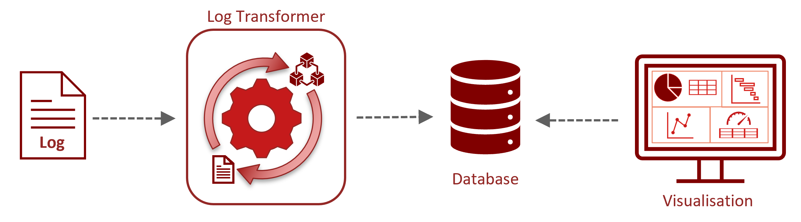
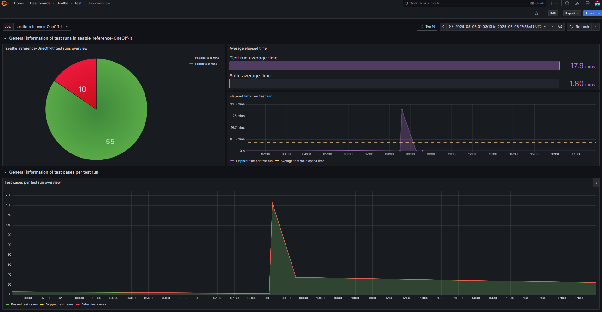
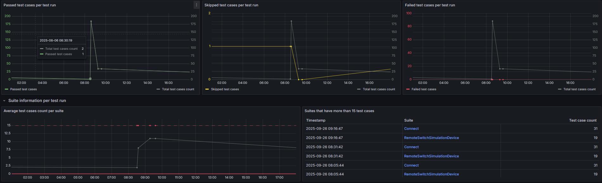
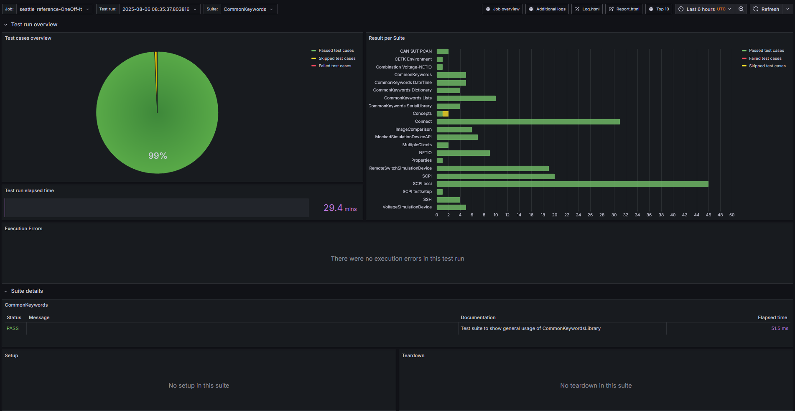

---
hide:
  - navigation
  - toc
---

# Overview

Software testing generates large amounts of data — test results and system logs — that are typically scattered across separate files and tools. Correlating them manually is tedious and error-prone.

**[cetk-lt](cli/index.md)** (comlet Embedded TestKit Log Transformer) solves this by ingesting **Robot Framework** (RF) test output from
[`cetk-cli`](https://comlet.github.io/cetk-cli/latest/){target="_blank"} and
additional log sources into a shared
[TimescaleDB](https://www.timescale.com/){target="_blank"} database, correlated by time, where
any PostgreSQL-compatible visualization tool — such as
[Grafana](https://grafana.com/){target="_blank"} — makes cross-source patterns visible.

=== "Key Concepts"
    * [RF `output.xml`](cli/rf.md) → transformed and inserted into TimescaleDB
    * [Additional log sources](cli/log.md) → transformed and inserted into TimescaleDB
    * All timestamps [normalized to UTC](timestamp.md) before insertion
    * Results visualized in any PostgreSQL-compatible tool (e.g., Grafana dashboards)

=== "Key Features"
    * Two subcommands: [`cetk-lt rf`](cli/rf.md) and [`cetk-lt log`](cli/log.md)
    * Unix-style [piping](piping.md) between subcommands
    * Flexible [timestamp and timezone](timestamp.md) handling
    * Extensible: new log sources can be added without changing existing pipelines

=== "Example Dashboards"
    The following screenshots show Grafana as one example of a PostgreSQL-compatible
    visualization tool built on cetk-lt data.

    **Job Overview** — all test runs and jobs at a glance

    
    

    **Test Run & Suite Overview** — drill into timing and results per test run

    
